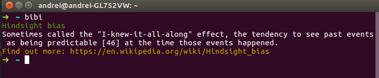

# bibi
Display a random cognitive bias on your terminal from the Wikipedia [List of cognitive biases](https://en.wikipedia.org/wiki/List_of_cognitive_biases) or send it to your e-mail.
<p align="center">

</p>


## About
I'm very interested in human misjudgment especially cognitive biases, so I built a simple Go program which fetches a random cognitive bias from the Wikipedia [List of cognitive biases](https://en.wikipedia.org/wiki/List_of_cognitive_biases) and displays it on the terminal. 
The purpose of this tool is to familiarise the user with as many cognitive biases as possible so he can have a better judgment. 
If you have a MailGun account you can also set up a daily reminder to your e-mail with a cognitive bias.

## Requirements

*Go should be [installed and set up](https://golang.org/doc/install) on your system.
*You should have a [MailGun](https://www.mailgun.com) account if you plan to send the cognitive bias to your inbox.

## Installation

```shell
$ go get github.com/zuzuleinen/bibi
$ cd $GOPATH/src/github.com/zuzuleinen/bibi/
$ go install
```

* If you want to set-up e-mail sending create a conf.json file bases on the conf.json.sample. [MailGun](https://www.mailgun.com) is supported only.

## Usage

If you want to display the cognitive bias on your terminal simply run:
```shell
$ bibi
```

If you want to send the cognitive bias to your e-mail run the executable with --email flag:
```shell
$ bibi --email
```
This option is a great way to create a daily reminder to read about a cognitive bias a day.
